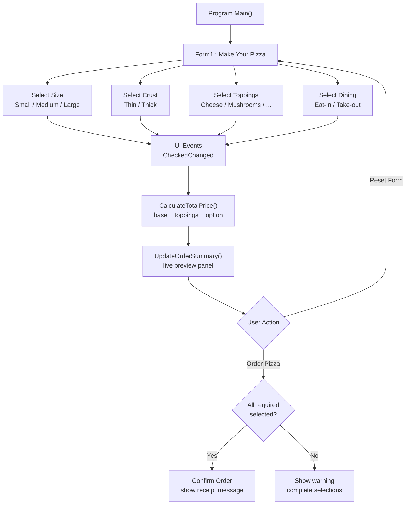
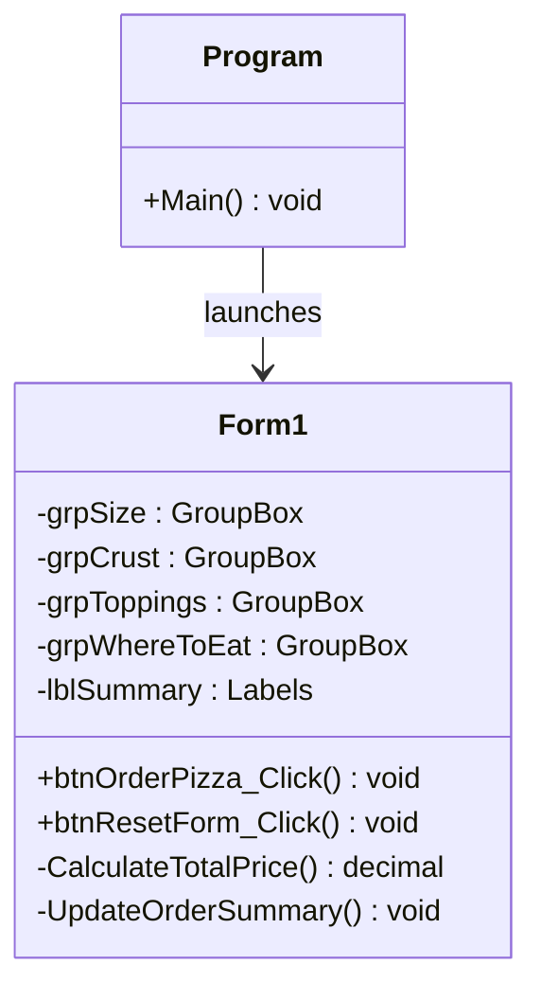

# 🍕 Pizza Ordering System

**نظام طلبات بيتزا متكامل بواجهة رسومية — مبني بـ C# Windows Forms (.NET)**
*A Windows Forms point-of-sale application for building custom pizza orders with live pricing and an instant order summary.*

<p align="center">
  
  
  
  
  
  
</p>

---

## 🌟 شرح عام | Overview

**Pizza Ordering System** هو تطبيق سطح مكتب لنقطة بيع (POS) مبني بلغة **C#** على منصة **Windows Forms (.NET)** داخل بيئة **Visual Studio 2022**.
يتيح التطبيق للعميل بناء طلب بيتزا مخصص خطوة بخطوة: اختيار الحجم، نوع العجين، الإضافات، وطريقة الاستلام (داخل المطعم أو خارجاً)، مع **تحديث فوري لملخص الطلب والسعر الإجمالي** قبل تأكيد الطلب.

يعتمد التصميم على **البرمجة الموجّهة بالأحداث (Event-Driven Programming)**: كل تحكم في الواجهة (RadioButton / CheckBox / Button) يطلق حدثاً تتم معالجته في `Form1.cs` لتحديث الملخص وحساب السعر لحظياً.

**In English:** A Windows Forms point-of-sale desktop app for building custom pizza orders. The customer selects size, crust type, toppings, and dining option, while the order summary and total price update **live**. The design follows event-driven programming: every control raises an event handled in `Form1.cs` to recalculate the order instantly.

---

## ✨ المميزات | Features

| # | الميزة | Feature | الوصف |
|---|--------|---------|-------|
| 1 | 🍕 تخصيص كامل | Full Customization | حجم + عجين + 6 إضافات + طريقة الاستلام |
| 2 | 🧮 تسعير لحظي | Live Pricing | حساب السعر الإجمالي تلقائياً مع كل تغيير |
| 3 | 🧾 ملخص الطلب | Order Summary | عرض تفصيلي حيّ للخيارات قبل التأكيد |
| 4 | 🔄 إعادة تعيين | Reset Form | تفريغ النموذج بالكامل بضغطة واحدة |
| 5 | ✅ تأكيد الطلب | Order Confirmation | التحقق من اكتمال الخيارات ثم تأكيد الطلب |
| 6 | 🖥️ واجهة نظيفة | Clean WinForms UI | تجميع منطقي للخيارات داخل GroupBoxes |

---

## 🖥️ مكونات الواجهة | UI Components

| القسم | Group | نوع التحكم | الخيارات المتاحة |
|-------|-------|-----------|------------------|
| Size | حجم البيتزا | RadioButtons | Small • Medium • Large |
| Crust Type | نوع العجين | RadioButtons | Thin Crust • Thick Crust |
| Toppings | الإضافات | CheckBoxes | Extra Cheese • Mushrooms • Tomatoes • Onion • Olives • Green Peppers |
| Where To Eat | طريقة الاستلام | RadioButtons | Eat in • Take out |
| Order Summary | ملخص الطلب | Labels | Size • Toppings • Crust Type • Where to Eat • **Total Price** |
| Actions | الإجراءات | Buttons | **Order Pizza** • **Reset Form** |

---

## 🏗️ المخطط المعماري | Architecture

### 1) مخطط تدفق الطلب | Order Flow



### 2) مخطط الفئات | Class Diagram



### 3) منطق التسعير | Pricing Logic

```text
Total Price = Base Price (Size)
            + Crust Extra (if any)
            + Sum(Selected Toppings)
            + Service Option (Eat-in / Take-out)
```

> 💡 **نموذج التسعير الافتراضي (قابل للتخصيص من ثوابت الكود في `Form1.cs`):**

| البند | الخيار | السعر الافتراضي |
|-------|--------|-----------------|
| الحجم (أساس) | Small | 5.00 |
| | Medium | 7.00 |
| | Large | 9.00 |
| الإضافات | لكل إضافة محددة | +0.50 → +1.00 |
| طريقة الاستلام | Eat in / Take out | بدون رسوم إضافية |

---

## 📁 هيكل المشروع | Project Structure

```text
Pizza-Ordering-System/
│
├── Pizza_Project(Solution).sln       # Visual Studio solution
├── Pizza_Project(Solution).csproj    # C# project file (MSBuild)
├── App.config                        # Application configuration
├── .gitignore                        # Excludes bin/ and obj/
├── README.md                         # This file
│
├── Program.cs                        # Entry point (Main)
├── Form1.cs                          # Form logic: events, pricing, summary
├── Form1.Designer.cs                 # Auto-generated UI layout code
├── Form1.resx                        # Form resources
│
└── Properties/                       # Assembly info and settings
```

---

## 🚀 التحميل والتشغيل | Download & Run

### ✅ المتطلبات | Prerequisites

| المتطلب | الوصف |
|---------|-------|
| **Windows 10 / 11** | نظام التشغيل (64-bit) |
| **Visual Studio 2022** | مع workload: *.NET desktop development* |
| **Git** (اختياري) | مطلوب لطريقة الاستنساخ فقط |

### 📥 الطريقة الأولى: استنساخ عبر Git

```bash
git clone https://github.com/Mulatef-Aldahia/Pizza-Ordering-System.git
cd Pizza-Ordering-System
```

### 📥 الطريقة الثانية: تحميل ZIP مباشر

1. ادخل إلى صفحة المستودع على GitHub.
2. اضغط الزر الأخضر **<> Code**.
3. اختر **Download ZIP** ثم فك الضغط.

### ▶️ التشغيل داخل Visual Studio 2022

1. افتح ملف الحل **`Pizza_Project(Solution).sln`** بالنقر المزدوج.
2. ابنِ المشروع: **Build → Build Solution** أو `Ctrl + Shift + B`.
3. شغّل التطبيق: **Debug → Start Without Debugging** أو `Ctrl + F5`.
4. ستفتح نافذة **MAKE YOUR PIZZA** — النظام جاهز ✅

---

## 🖥️ دليل الاستخدام | Usage Guide

1. **اختر الحجم** من مجموعة `Size` (Small / Medium / Large).
2. **اختر نوع العجين** من مجموعة `Crust Type`.
3. **حدّد الإضافات** المطلوبة من مجموعة `Toppings` (يمكن اختيار أكثر من واحدة).
4. **حدّد طريقة الاستلام** من مجموعة `Where To Eat`.
5. راجع **ملخص الطلب والسعر الإجمالي** في اللوحة اليمنى (يتحدث لحظياً).
6. اضغط **Order Pizza** لتأكيد الطلب، أو **Reset Form** لبدء طلب جديد.

---

## 📸 لقطات الشاشة | Screenshots

<!-- لأنشئ لقطة حقيقية: شغّل التطبيق، اضغط PrintScreen، احفظ الصورة في
     مجلد docs/images باسم main-form.png ثم أزل علامتي التعليق أدناه: -->

<!--  -->

> 📌 سيتم إضافة لقطات الشاشة الرسمية للنموذج في التحديث القادم.

---

## 🗺️ خارطة الطريق | Roadmap

- [x] واجهة تخصيص الطلب (حجم / عجين / إضافات / استلام)
- [x] ملخص طلب حيّ وحساب سعر تلقائي
- [x] إعادة تعيين النموذج
- [ ] حفظ سجل الطلبات في ملف أو قاعدة بيانات
- [ ] طباعة إيصال الطلب (Receipt Printing)
- [ ] تحقق أقوى من المدخلات ورسائل تنبيه مخصصة
- [ ] دعم تعدد العملات واللغات (AR / EN)
- [ ] ترحيل الواجهة إلى WPF أو ASP.NET مستقبلاً

---

## 🤝 المساهمة | Contributing

1. Fork المستودع
2. أنشئ فرعاً: `git checkout -b feature/my-feature`
3. Commit: `git commit -m "feat: add my feature"`
4. Push: `git push origin feature/my-feature`
5. افتح Pull Request

---

## 📄 الرخصة | License

هذا المشروع مرخص تحت رخصة **MIT** — للاستخدام والتعديل بحرية مع الإشارة إلى المصدر.

---

## 👨💻 المطور | Developer

**ملاطف الداهية — Mulatef Aldahia**

<p align="center">
  <a href="https://github.com/Mulatef-Aldahia">
    
  </a>
</p>

---

<p align="center">
  <b>Pizza Ordering System © 2026 — Built with C# & Windows Forms ❤️</b>
</p>